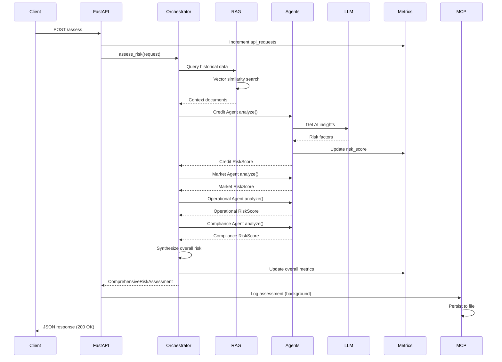

# 🏦 Financial Risk Assessment Platform

> An AI-powered multi-agent system for comprehensive financial risk assessment with real-time monitoring and analytics.

[](https://www.python.org/downloads/)
[](https://fastapi.tiangolo.com/)
[](LICENSE)
[](https://prometheus.io/)
[](https://grafana.com/)

## 📋 Table of Contents

- [Overview](#-overview)
- [Architecture](#-architecture)
- [Features](#-features)
- [Technology Stack](#-technology-stack)
- [Prerequisites](#-prerequisites)
- [Installation](#-installation)
- [Usage](#-usage)
- [Monitoring & Observability](#-monitoring--observability)
- [Project Structure](#-project-structure)
- [Risk Assessment Details](#-risk-assessment-details)


---

## 🎯 Overview

The **Financial Risk Assessment Platform** is an enterprise-grade system that leverages AI-powered multi-agent architecture to provide comprehensive risk analysis across four critical dimensions:

- **💰 Credit Risk** - Debt ratios, liquidity, and financial health
- **📈 Market Risk** - Volatility, beta, and market exposures
- **⚙️ Operational Risk** - IT systems, processes, and supply chain
- **📜 Compliance Risk** - Regulatory adherence and legal concerns

### Key Capabilities

- **Multi-Agent Analysis**: Specialized agents for each risk category
- **RAG-Enhanced Intelligence**: Historical context via document retrieval
- **Real-Time Monitoring**: Prometheus metrics + Grafana dashboards
- **Agentic Workflow**: LangGraph orchestration for complex reasoning
- **RESTful API**: FastAPI-powered endpoints for easy integration
- **Persistent Storage**: File-based assessment history
- **Alerting**: Automated alerts for critical risk thresholds

---

## 🏗️ Architecture

### System Architecture Diagram

```
┌─────────────────────────────────────────────────────────────────────────┐
│                          CLIENT APPLICATIONS                            |
│                    (Web UI, Mobile, Third-party Systems)                |
└────────────────────────────────┬────────────────────────────────────────┘
                                 │
                                 │ HTTPS/REST
                                 ▼
┌─────────────────────────────────────────────────────────────────────────┐
│                           FASTAPI GATEWAY                               |
│  ┌────────────────┐  ┌──────────────┐  ┌─────────────────────────┐      |
│  │  /assess       │  │  /metrics    │  │  /health  /history      │      |
│  │  (POST)        │  │  (GET)       │  │  (GET)                  │      |
│  └────────┬───────┘  └──────┬───────┘  └────────┬────────────────┘      |
└───────────┼──────────────────┼───────────────────┼──────────────────────┘
            │                  │                   │
            │                  │                   │
            ▼                  │                   ▼
┌───────────────────────────┐  │         ┌──────────────────────┐
│   ORCHESTRATOR            │  │         │   MCP SERVER         │
│   (LangGraph Workflow)    │  │         │   (Assessment Store) │
│                           │  │         └──────────────────────┘
│  ┌─────────────────────┐  │  │
│  │  State Management   │  │  │
│  │  - Company Data     │  │  │
│  │  - Risk Scores      │  │  │
│  │  - Iteration Count  │  │  │
│  └─────────────────────┘  │  │
│           │               │  │
│           ▼               │  │
│  ┌─────────────────────┐  │  │         ┌──────────────────────┐
│  │  RAG Retrieval      │──┼──┼────────▶│  RAG PIPELINE       │
│  │  Node               │  │  │         │                     │
│  └──────────┬──────────┘  │  │         │  ┌────────────────┐ │
│             │             │  │         │  │ FAISS Vector   │ │
│             ▼             │  │         │  │ Store          │ │
│  ┌─────────────────────┐  │  │         │  └────────────────┘ │
│  │  Risk Agent Nodes   │  │  │         │  ┌────────────────┐ │
│  │                     │  │  │         │  │ HuggingFace    │ │
│  │  ┌───────────────┐  │  │  │         │  │ Embeddings     │ │
│  │  │ Credit Agent  │  │  │  │         │  └────────────────┘ │
│  │  └───────────────┘  │  │  │         │  ┌────────────────┐ │
│  │  ┌───────────────┐  │  │  │         │  │ PDF Documents  │ │
│  │  │ Market Agent  │  │  │  │         │  │ (./documents/) │ │
│  │  └───────────────┘  │  │  │         │  └────────────────┘ │
│  │  ┌───────────────┐  │  │  │         └──────────────────────┘
│  │  │Operational    │  │  │  │
│  │  │Agent          │  │  │  │
│  │  └───────────────┘  │  │  │
│  │  ┌───────────────┐  │  │  │
│  │  │Compliance     │  │  │  │
│  │  │Agent          │  │  │  │
│  │  └───────────────┘  │  │  │
│  └──────────┬──────────┘  │  │
│             │             │  │
│             ▼             │  │
│  ┌─────────────────────┐  │  │
│  │  Synthesis Node     │  │  │
│  │  - Weighted Score   │  │  │
│  │  - Recommendations  │  │  │
│  └─────────────────────┘  │  │
└─────────────┬──────────────┘  │
              │                 │
              │                 │
              ▼                 │
┌───────────────────────────────▼──────────────────────┐
│              GROQ LLM API (Qwen 3-32B)                │
│              - Risk Analysis                          │
│              - Factor Identification                  │
│              - Contextual Reasoning                   │
└───────────────────────────────────────────────────────┘
              │
              │ Metrics Flow
              ▼
┌─────────────────────────────────────────────────────────────┐
│                  MONITORING STACK                            │
│  ┌──────────────┐  ┌──────────────┐  ┌──────────────────┐    │
│  │  Prometheus  │◀─│  Metrics     │  │   Alertmanager   │    │
│  │  (Port 9090) │  │  Exporter    │  │   (Optional)     │    │
│  └──────┬───────┘  │  (Port 8000) │  └──────────────────┘    │
│         │          └──────────────┘                          │
│         │                                                    │
│         ▼                                                    │
│  ┌──────────────┐                                            │
│  │   Grafana    │                                            │
│  │  (Port 3000) │                                            │
│  │  - 13 Panels │                                            │
│  │  - 7 Alerts  │                                            │
│  └──────────────┘                                            │
└─────────────────────────────────────────────────────────────┘
```

### Workflow Sequence



### Component Interaction

```
┌─────────────────────────────────────────────────────────────┐
│                      DATA FLOW                              │
└─────────────────────────────────────────────────────────────

INPUT                  PROCESSING                    OUTPUT
─────                  ──────────                    ──────

Financial Data   ──▶   RAG Context Retrieval   ──▶  Risk Scores
Market Data      ──▶   Multi-Agent Analysis    ──▶  Risk Levels
Compliance Reqs  ──▶   LLM Enhancement         ──▶  Recommendations
                       Weighted Synthesis            Assessment ID
                       Metric Tracking               Timestamp
```

---

## ✨ Features

### Core Capabilities

- 🤖 **Multi-Agent Risk Analysis**
  - Specialized agents for credit, market, operational, and compliance risk
  - LLM-enhanced reasoning with Groq's Qwen 3-32B model
  - Weighted score synthesis for holistic assessment

- 📚 **RAG-Powered Intelligence**
  - FAISS vector store for fast similarity search
  - HuggingFace embeddings (all-MiniLM-L6-v2)
  - Automatic PDF document processing
  - Historical context integration

- 🔄 **Agentic Workflow**
  - LangGraph state management
  - Conditional routing and iteration
  - Memory checkpointing for complex workflows
  - Thread-based conversation tracking

- 💾 **Data Persistence**
  - File-based assessment storage
  - Company-wise history tracking
  - JSON export capability
  - Audit trail maintenance

### Risk Assessment Features

| Risk Type | Metrics Analyzed | Thresholds |
|-----------|------------------|------------|
| **Credit** | Debt-to-equity, Current ratio, Interest coverage, Revenue growth | Low < 0.3, Medium < 0.6, High < 0.85, Critical ≥ 0.85 |
| **Market** | Volatility, Beta, FX exposure, Commodity exposure | Low < 0.3, Medium < 0.6, High < 0.85, Critical ≥ 0.85 |
| **Operational** | System downtime, Turnover rate, Process errors, Supplier concentration, Security incidents | Low < 0.3, Medium < 0.6, High < 0.85, Critical ≥ 0.85 |
| **Compliance** | Regulatory violations, Audit findings, SOX/GDPR/Basel compliance, Litigation | Low < 0.3, Medium < 0.6, High < 0.85, Critical ≥ 0.85 |

---

## 🛠️ Technology Stack

### Backend Framework
- **FastAPI** - Modern, fast web framework for building APIs
- **Uvicorn** - Lightning-fast ASGI server
- **Pydantic** - Data validation using Python type annotations

### AI/ML Stack
- **LangChain** - Framework for LLM applications
- **LangGraph** - Multi-agent workflow orchestration
- **Groq** - Fast LLM inference (Qwen 3-32B model)
- **HuggingFace** - Transformer models and embeddings
- **FAISS** - Vector similarity search

### Monitoring & Observability
- **Prometheus** - Metrics collection and alerting
- **Grafana** - Visualization and dashboarding
- **prometheus_client** - Python metrics library

### Data & Storage
- **PyPDF** - PDF document processing
- **JSON** - Structured data storage
- **FAISS** - Vector database

### Development Tools
- **pytest** - Testing framework
- **Docker** - Containerization
- **Docker Compose** - Multi-container orchestration

---

## 📋 Prerequisites

### Required Software

- **Python 3.11+** - [Download](https://www.python.org/downloads/)
- **Docker** - [Install](https://docs.docker.com/get-docker/)
- **Docker Compose** - [Install](https://docs.docker.com/compose/install/)
- **Git** - [Install](https://git-scm.com/downloads)

### API Keys

- **Groq API Key** - Sign up at [console.groq.com](https://console.groq.com/)


## 🚀 Installation

### 1. Clone the Repository

```bash
git clone https://github.com/yourusername/risk-assessment-platform.git
cd risk-assessment-platform
```

### 2. Create Virtual Environment

```bash
# Create virtual environment
python -m venv venv

# On Windows:
venv\Scripts\activate
```

### 3. Install Dependencies

```bash
pip install --upgrade pip
pip install -r requirements.txt
```

### 3. Configure Environment

Create a `.env` file in the project root:

```bash
# API Configuration
GROQ_API_KEY=your_groq_api_key_here
API_PORT=8080
PROMETHEUS_PORT=8000

# Vector Store
VECTOR_DB_PATH=./vector_store

# Monitoring (Optional)
PROMETHEUS_PORT=9090
GRAFANA_PORT=3000
```

### 4. Initialize Vector Store

Place your PDF documents in the `documents/` folder:

```bash
# Example: Add financial reports, risk guidelines, etc.
cp your-financial-docs/*.pdf documents/
```

The RAG pipeline will automatically process these documents on startup.

---


## 📖 Usage

### Start the Application

#### Option 1: Manual Start

```bash
# Terminal 1: Start monitoring stack
docker-compose -f docker-compose.monitoring.yml up -d

# Terminal 2: Start API
export GROQ_API_KEY="your-key-here"
python -m app.main
```

#### Option 2: Using Setup Script

```bash
./setup_monitoring.sh
export GROQ_API_KEY="your-key-here"
python -m app.main
```

### Make a Risk Assessment Request

```bash
curl -X POST http://localhost:8080/assess \
  -H "Content-Type: application/json" \
  -d '{
    "company_id": "ACME-001",
    "financial_data": {
      "debt_to_equity": 1.5,
      "current_ratio": 1.2,
      "interest_coverage": 3.5,
      "revenue_growth": 0.08,
      "foreign_currency_exposure": 0.25,
      "commodity_exposure": 0.15,
      "system_downtime_hours": 24,
      "employee_turnover_rate": 0.12,
      "process_error_rate": 0.015,
      "top_supplier_concentration": 0.3,
      "security_incidents_year": 2,
      "regulatory_violations_year": 0,
      "compliance_audit_findings": 3,
      "pending_litigation": 1
    },
    "market_data": {
      "volatility": 0.22,
      "beta": 1.15
    },
    "compliance_requirements": ["SOX", "GDPR"]
  }'
```

### Example Response

```json
{
  "company_id": "ACME-001",
  "assessment_id": "RA-20250104120530",
  "timestamp": "2025-01-04T12:05:30.123Z",
  "overall_risk_score": 0.42,
  "overall_risk_level": "medium",
  "credit_risk": {
    "risk_type": "credit",
    "score": 0.35,
    "level": "medium",
    "factors": ["Moderate debt-to-equity ratio", "Moderate liquidity"],
    "confidence": 0.85
  },
  "market_risk": {
    "risk_type": "market",
    "score": 0.25,
    "level": "low",
    "factors": ["Moderate market volatility"],
    "confidence": 0.8
  },
  "operational_risk": {
    "risk_type": "operational",
    "score": 0.18,
    "level": "low",
    "factors": [],
    "confidence": 0.75
  },
  "compliance_risk": {
    "risk_type": "compliance",
    "score": 0.1,
    "level": "low",
    "factors": [],
    "confidence": 0.9
  },
  "recommendations": [
    "Monitor liquidity ratios closely and maintain adequate cash reserves",
    "Consider partial hedging of major market exposures"
  ]
}
```

### Generate Test Data

```bash
python test_monitoring.py
```

This will create:
- 5 low-risk assessments
- 8 medium-risk assessments
- 6 high-risk assessments
- 3 critical-risk assessments

---

## 📊 Monitoring & Observability

### Access Dashboards

| Dashboard | URL | Credentials |
|-----------|-----|-------------|
| **Grafana** | http://localhost:3000 | admin / admin |
| **Prometheus** | http://localhost:9090 | - |
| **API Docs** | http://localhost:8080/docs | - |

### Grafana Dashboard Overview

The platform includes a comprehensive dashboard with 13 panels:

#### Performance Metrics
1. **API Request Rate** - Requests per second by endpoint
2. **API Response Time** - P50/P95 latency percentiles
3. **Agent Response Time** - Individual agent performance

#### Business Metrics
4. **High Risk Companies** - Real-time gauge of companies at risk
5. **Assessments (Last Hour)** - Recent assessment volume
6. **Current Risk Scores** - Live scores across all risk types
7. **Assessments by Risk Level** - Distribution over time
8. **High/Critical Risk Distribution** - Pie chart by risk type

#### System Health
9. **System Error Rate** - Errors per second by component
10. **Agent Request Rate** - Agent usage patterns
11. **RAG Query Rate** - Document retrieval frequency
12. **Vector Store Documents** - Total indexed documents
13. **Documents Processed** - Cumulative processing count

### Active Alerts

| Alert | Threshold | Severity |
|-------|-----------|----------|
| HighRiskCompaniesThresholdExceeded | > 10 companies | Warning |
| HighErrorRate | > 0.1 errors/sec | Critical |
| SlowAPIResponseTime | P95 > 5s | Warning |
| SlowAgentResponseTime | P95 > 10s | Warning |
| CriticalRiskAssessmentSpike | > 5/hour | Critical |
| HighRAGQueryFailures | > 0.05 failures/sec | Warning |
| APIDown | Service unavailable 1m+ | Critical |

---

## 📚 API Documentation

### Endpoints

#### 1. POST /assess
Perform comprehensive risk assessment.

**Request:**
```json
{
  "company_id": "string",
  "financial_data": {
    "debt_to_equity": 0,
    "current_ratio": 0,
    "interest_coverage": 0,
    "revenue_growth": 0,
    ...
  },
  "market_data": {
    "volatility": 0,
    "beta": 0
  },
  "compliance_requirements": ["string"]
}
```

**Response:** `200 OK` - ComprehensiveRiskAssessment object

#### 2. GET /health
Check API health status.

**Response:**
```json
{
  "status": "ok",
  "metrics": {
    "total_assessments": 0,
    "active_companies": 0,
    "system_health": "healthy"
  }
}
```

#### 3. GET /history/{company_id}
Retrieve assessment history for a company.

**Parameters:**
- `company_id` (path) - Company identifier
- `limit` (query, optional) - Number of records (default: 10)

**Response:**
```json
{
  "company_id": "string",
  "assessments": [...]
}
```

#### 4. GET /metrics
Prometheus metrics endpoint.

**Response:** Prometheus text format

---

## 📁 Project Structure

```
FINANCIAL-RISK-ASSESSMENT/
│
├── app/
│   ├── __pycache__/            # Python bytecode cache
│   ├── agents.py               # Risk assessment agents (Credit, Market, Operational, Compliance)
│   ├── config.py               # Application configuration and settings
│   ├── main.py                 # FastAPI application entry point
│   ├── mcp_server.py           # Assessment storage and history management
│   ├── metrics.py              # Prometheus metrics definitions
│   ├── models.py               # Pydantic data models
│   ├── orchestrator.py         # LangGraph workflow orchestration
│   └── rag_pipeline.py         # RAG implementation with FAISS
│
├── data/                       # Runtime data (auto-generated)
│   └── assessments.json        # Persisted assessment history
│
├── documents/                  # PDF documents for RAG
│   └── kome-text.pdf          # Sample financial document
│
├── tests/
│   ├── test_api.py            # API endpoint tests
│   └── test_assess.py         # Assessment logic tests
│
├── vector_store/              # FAISS vector database (auto-generated)
│   ├── index.faiss            # FAISS index file
│   └── index.pkl              # Pickled document store
│
├── venv/                      # Python virtual environment
│
├── .env                       # Environment variables (not in repo)
├── .gitignore                 # Git ignore patterns
├── Dockerfile                 # Docker image definition
├── README.md                  # This file
└── requirements.txt           # Python dependencies
---

## 🔍 Risk Assessment Details

### Credit Risk Analysis

**Factors Evaluated:**
- Debt-to-equity ratio
- Current ratio (liquidity)
- Interest coverage
- Revenue growth

**Scoring Logic:**
```python
if debt_to_equity > 2: score += 0.3
elif debt_to_equity > 1: score += 0.15

if current_ratio < 1: score += 0.25
elif current_ratio < 1.5: score += 0.1

if interest_coverage < 1.5: score += 0.25
elif interest_coverage < 3: score += 0.1

if revenue_growth < -0.1: score += 0.2
elif revenue_growth < 0: score += 0.1
```

### Market Risk Analysis

**Factors Evaluated:**
- Market volatility
- Beta (systematic risk)
- Foreign currency exposure
- Commodity price exposure

**Scoring Logic:**
```python
if volatility > 0.3: score += 0.25
elif volatility > 0.2: score += 0.15

if beta > 1.5: score += 0.2
elif beta > 1.2: score += 0.1

if fx_exposure > 0.5: score += 0.2
elif fx_exposure > 0.3: score += 0.1

if commodity_exposure > 0.4: score += 0.15
```

### Operational Risk Analysis

**Factors Evaluated:**
- IT system downtime
- Employee turnover rate
- Process error rate
- Supplier concentration
- Cybersecurity incidents

**Scoring Logic:**
```python
if system_downtime > 100: score += 0.2
elif system_downtime > 50: score += 0.1

if turnover_rate > 0.25: score += 0.15
elif turnover_rate > 0.15: score += 0.08

if process_error_rate > 0.05: score += 0.2
elif process_error_rate > 0.02: score += 0.1

if supplier_concentration > 0.5: score += 0.25
elif supplier_concentration > 0.3: score += 0.12

if security_incidents > 5: score += 0.3
elif security_incidents > 2: score += 0.15
```

### Compliance Risk Analysis

**Factors Evaluated:**
- Regulatory violations
- Compliance audit findings
- SOX compliance
- GDPR compliance
- Basel III compliance
- Pending litigation

**Scoring Logic:**
```python
if violations > 3: score += 0.35
elif violations > 1: score += 0.2
elif violations == 1: score += 0.1

if audit_findings > 10: score += 0.25
elif audit_findings > 5: score += 0.15

if not sox_compliant: score += 0.2
if not gdpr_compliant: score += 0.15
if not basel_compliant: score += 0.25

if litigation > 5: score += 0.2
elif litigation > 2: score += 0.1
```

### Overall Risk Synthesis

**Weighted Aggregation:**
```python
overall_score = (
    credit_score × 0.30 +
    market_score × 0.25 +
    operational_score × 0.20 +
    compliance_score × 0.25
)
```

**Risk Levels:**
- **Low**: score < 0.3
- **Medium**: 0.3 ≤ score < 0.6
- **High**: 0.6 ≤ score < 0.85
- **Critical**: score ≥ 0.85

---

## 🎯 Use Cases

### Financial Institutions
- **Banks**: Credit risk assessment for loan applications
- **Insurance**: Underwriting risk evaluation
- **Investment Firms**: Portfolio risk analysis
- **FinTech**: Real-time credit scoring

### Corporate Risk Management
- **Enterprise**: Vendor risk assessment
- **Supply Chain**: Supplier financial health monitoring
- **M&A**: Due diligence automation
- **Compliance**: Regulatory risk tracking

### Consulting & Advisory
- **Risk Consultants**: Client assessment automation
- **Auditors**: Continuous monitoring platforms
- **Legal**: Litigation risk evaluation
- **Accounting**: Financial health analysis

---

## 🌟 Star History

If you find this project useful, please consider giving it a star on GitHub! ⭐

[](https://star-history.com/#yourusername/risk-assessment-platform&Date)

---

<div align="center">

**Built with ❤️ using FastAPI, LangChain, and Groq**

</div>

